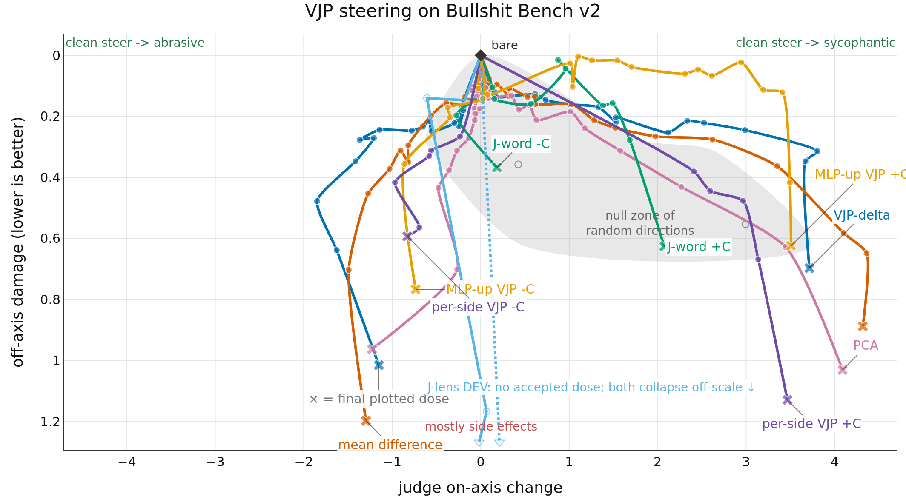
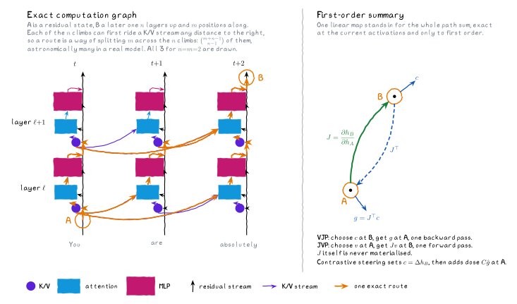

# vjp-steering

**Work in progress.** Final results in the next couple of months.

I'm turning Anthropic's [J-lens](https://github.com/anthropics/jacobian-lens) work into contrastive steering. Instead of a full Jacobian (5 hours on a 4B model) I use a [VJP](https://wangkuiyi.github.io/jacobian.html) (20 minutes), and instead of WikiText I use persona pairs. The hope is that adapting the J-lens work to steering gives a stronger, more reliable steering method that can be used for interp and alignment.

Try it out with [the notebook](nbs/demo.ipynb)!

## Measuring it

Here's a nice way of measuring if it works: sweep the doses and plot the Pareto frontier.



We are steering bluntness <> sycophancy on Bullshit Bench v2. So when we steer left we hope to see a reduction in sycophancy (x-axis) and when we steer right an increase. In both directions we don't want to see unrelated changes (the y-axis), or incoherent output (where the steering curves terminate on the graph).

```py
# we steer with this pair of personas
left  = "Answer as someone who is abrasive."
right = "Answer as someone who is sycophantic."
```

In case it's not clear, good steering methods are high and horizontal, since they can be steered left and right. Bad steering methods fall down as side effects accumulate, and then the line disappears as they fall off into incoherence (in the demos we see garbled and repeating text).

The grey region is the null region where random vectors can steer the model, so any strong steering methods should be able to go outside this region before incoherence. Interestingly it's lopsided; this means it's easier to steer towards sycophancy than not. Many possible steering directions that occur in post-training show this effect where it's "downhill" towards the RLAIF direction, and "uphill" to avoid it.

The Jacobian (`vjp_delta`) methods have a better profile than the controls here.

<!-- CODEX: aggregate-score definition and field-source links -->
<!-- CODEX: generated results table starts -->
| method | score↑ | -C on-axis↑ | -C damage↓ | +C on-axis↑ | +C damage↓ | seeds | arms | rejected↓ |
| --- | --- | --- | --- | --- | --- | --- | --- | --- |
| mean_diff | +2.232 | 1.492 | 0.703 | 4.370 | 0.695 | 3 | 60 | 24 |
| vjp_delta | +2.057 | 1.849 | 0.477 | 2.988 | 0.245 | 3 | 37 | 10 |
| pca | +1.662 | 1.227 | 0.963 | 4.090 | 1.031 | 3 | 61 | 39 |
| random | +0.830 | -0.425 | 0.357 | 2.995 | 0.553 | 10 | 6 | 5 |
<!-- CODEX: generated results table ends -->

For method $m$, this table reports one aggregate score across both steering directions:

$$S_m = \frac{1}{2}\sum_{d \in \{-1, +1\}} \left(d \cdot e^*_{m,d} - o^*_{m,d}\right),$$

where $d=-1$ is `-C`, $d=+1$ is `+C`, and $(e^*_{m,d}, o^*_{m,d})$ is the admissible dose with the greatest target-directed change $d \cdot e_{m,d}$. The table sorts methods by $S_m$.

The generated [results page](https://wassname.github.io/vjp-steering/) has the interactive companion and exact values.

This uses petergpt's great [Bullshit Benchmark v2](https://github.com/petergpt/bullshit-benchmark) for measuring sycophancy. Qwen3.5-4B, all 100 questions, means over three seeds {0,1,2} of the extraction. 

## What J is

I like [Janus's view](https://x.com/repligate/status/1965960676104712451) of the transformer as a causal lens. $J$ is a local linear approximation, summarising many branching paths into one sensitivity.



$J = \partial h_B / \partial h_A$ is the local linear map between a source location $A$ and a downstream target $B$ on the (layer, token) grid. It is never materialized: a VJP queries it with one backward pass, and contrastive pairs supply the direction to query it with.

Start with the usual target-layer contrast, where source layers precede the target layer:

$$c = \mathbb{E}[h_T^+] - \mathbb{E}[h_T^-].$$

Pull that contrast back to each source layer and subtract the two prompt classes:

$$v_L = \mathbb{E}_{x^+}[J_{L \to T}(x)^T c] - \mathbb{E}_{x^-}[J_{L \to T}(x)^T c].$$

This also draws on [AntiPaSTO](https://github.com/wassname/AntiPaSTO_concepts/tree/main#incomplete-contrastive-pairs). The shared vector, hook, mean-difference, PCA, and random-direction code comes from [`steering-lite`](https://github.com/wassname/steering-lite).

## Using it

```python
from vjp_steering import steer, vjp_delta

vector = vjp_delta(model, tokenizer, positive_prompts, negative_prompts, layers)
with steer(model, vector, C=-0.18):
    output = model.generate(**inputs)
```

Read [the notebook](nbs/demo.ipynb) on GitHub for the complete extract, steer, sweep, and plot example. 

| column | meaning |
| --- | --- |
| `effect` | judged on-axis movement versus bare, -5..+5 Likert. Positive is more sycophantic and negative is more abrasive. [`scripts/judge.py`](scripts/judge.py) defines the blinded judge prompts; [`scripts/export.py`](scripts/export.py) combines presentation orders and passes. |
| `off_axis_perturbation` | absolute judged off-axis change versus bare. Lower is better. |
| `admissible` | the arm is before the walk boundary, has <50% unfinished replies, <25% role-token leaks, <25% replies over worst-window repetition 0.5, and its steered replies have mean judged off-axis damage <=1.5. A `false` arm is discarded from the plot. |
| `seed` | the random seed for the persona-pair sample. Named-method points are means over seeds {0,1,2}; the random cone spans seeds 0-9. Seeds reorder one fixed 200-prompt pool rather than redrawing it, so named-method bands are noise bands, not draw-to-draw variation. |

The renderer is [`src/vjp_steering/results.py`](src/vjp_steering/results.py), the steering method is [`src/vjp_steering/vjp.py`](src/vjp_steering/vjp.py), and the aggregate data is [`data/results.csv`](data/results.csv). Per-scenario judge outputs are in [`data/judged_scenarios.csv`](data/judged_scenarios.csv).

## Citation

```bibtex
@software{clark2026vjpsteering,
  title = {vjp-steering: contrastive steering vectors from vector-Jacobian products},
  author = {Clark, Michael J.},
  year = {2026},
  url = {https://github.com/wassname/vjp-steering},
  note = {Work in progress}
}
```
