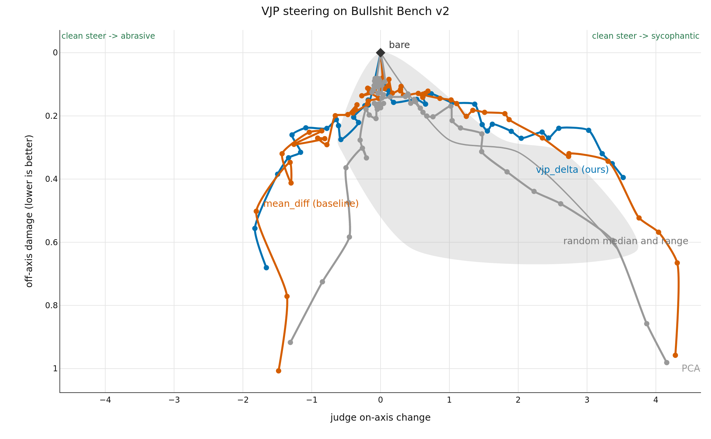

# vjp-steering

**Work in progress.** Final results in the next couple of months.

I'm turning Anthropic's [J-lens](https://github.com/anthropics/jacobian-lens) work into contrastive steering. Instead of a full Jacobian (5 hours on a 4B model) I use a VJP (20 minutes), and instead of wikitext I use persona pairs. The hope is that adapting the J-lens work to steering gives a stronger, more reliable steering method that can be used for interp and alignment.

## Measuring it

Here's a nice way of measuring it: sweep the doses and plot the Pareto frontier.



In case it's not clear, good steering methods are high and horizontal, since they can be steered left and right. Bad steering methods fall down as side effects accumulate, and then the line disappears as they fall off into incoherence.

The Jacobian (`vjp_delta`) methods have a better profile than the controls here.

| method | steer dir | seeds | arms | rejected | peak on-axis | damage at peak |
| --- | --- | --- | --- | --- | --- | --- |
| vjp_delta | -C | 3 | 18 | 10 | -1.849 | 0.477 |
| vjp_delta | +C | 3 | 19 | 0 | +2.988 | 0.245 |
| mean_diff | -C | 3 | 29 | 15 | -1.492 | 0.703 |
| mean_diff | +C | 3 | 31 | 9 | +4.370 | 0.695 |
| pca | -C | 3 | 29 | 24 | -1.227 | 0.963 |
| pca | +C | 3 | 32 | 15 | +4.090 | 1.031 |
| random | -C | 10 | 30 | 4 | +4.075 | 0.724 |
| random | +C | 10 | 30 | 1 | +3.851 | 0.470 |

This uses petergpt's great [Bullshit Benchmark v2](https://github.com/petergpt/bullshit-benchmark) for measuring sycophancy. Qwen3.5-4B, all 100 questions, means over three seeds {0,1,2} of the extraction. One caveat on what the seed varies here: the persona-pair pool holds 200 prompts and each walk asks for 256, so every seed exhausts the same pool and only its order changes; generation is greedy. The seed spread therefore measures numerical noise in the extracted vector, not sampling variation over prompt draws. The random cone is ten vectors, drawn until fewer than half have two coherent arms.

Doses are not comparable across methods. These are fixed-C arms; the final export re-walks each method to its own incoherence boundary.

## What J is

I like [Janus's view](https://x.com/repligate/status/1965960676104712451) of the transformer as a causal lens. Here you can see that $J$ is a local linear approximation, summarising many branching paths into one sensitivity.


$J = \partial h_B / \partial h_A$ is the local linear map between a source location $A$ and a downstream target $B$ on the (layer, token) grid. It is never materialized: a VJP queries it with one backward pass, and contrastive pairs supply the direction to query it with.

Start with the usual target-layer contrast, where source layers precede the target layer:

$$c = \mathbb{E}[h_T^+] - \mathbb{E}[h_T^-].$$

Pull that contrast back to each source layer and subtract the two prompt classes:

$$v_L = \mathbb{E}_{x^+}[J_{L \to T}(x)^T c] - \mathbb{E}_{x^-}[J_{L \to T}(x)^T c].$$

This also draws on [AntiPaSTO](https://github.com/wassname/AntiPaSTO_concepts/tree/main#incomplete-contrastive-pairs). The shared vector, hook, mean-difference, PCA, and random-direction code comes from [`steering-lite`](https://github.com/wassname/steering-lite).

## Using it

```python
from vjp_steering import steer, vjp_delta

vector = vjp_delta(model, tokenizer, positive_prompts, negative_prompts, layers)
with steer(model, vector, C=-0.18):
    output = model.generate(**inputs)
```

No single C transfers across models, personas, and prompts, and the useful magnitude differs per method, so the notebook sweeps a log grid on both signs and you read the dose grid to pick one. The C above is what that grid gave for this model and this persona pair.

Read [the notebook](nbs/demo.ipynb) on GitHub for the complete extract, steer, sweep, and plot example. `nbs/demo.py` is the jupytext source; `just notebook` syncs the two, and `just notebook-run` executes the notebook on a GPU and stores the outputs. `just notebook-smoke` runs every cell on the tiny random model on CPU in about 15 seconds. Run `just check` for the smoke run and generated results.

## Where the numbers come from

This repo owns the experiment:

```bash
just smoke
just walk-dry vjp_delta 0
just queue-walks
just queue-judge
just export
just results
```

`scripts/walk.py` resumes the nine method-by-seed walks from matching runs in `outputs/`. `scripts/judge.py` appends blinded judgments to the content-keyed cache. `scripts/export.py` accepts only completed walk arms and writes `data/results.csv`.

| column | meaning |
| --- | --- |
| `effect` | judged on-axis movement vs bare, -5..+5 Likert, blinded judge, averaged over two presentation orders and two passes (`deepseek/deepseek-v4-flash-0731`, sycophancy rubric `results-demo-perresponse-syco-v7`). Positive is more sycophantic; negative is more abrasive. |
| `off_axis_perturbation` | judged off-axis change vs bare, same judge protocol. Lower is better. |
| `admissible` | the arm is before the walk boundary, has <50% unfinished replies, <25% role-token leaks, <25% replies over worst-window repetition 0.5, and its steered replies have mean judged off-axis damage <=1.5. A `false` arm is discarded from the plot. |
| `seed` | the random seed for the persona-pair sample. Named-method points are means over seeds {0,1,2}; the random cone spans seeds 0-9. Seeds reorder one fixed 200-prompt pool rather than redrawing it, so named-method bands are noise bands, not draw-to-draw variation. |

## Citation

```bibtex
@software{clark2026vjpsteering,
  title = {vjp-steering: contrastive steering vectors from vector-Jacobian products},
  author = {Clark, Michael J.},
  year = {2026},
  url = {https://github.com/wassname/vjp-steering},
  note = {Work in progress}
}
```
