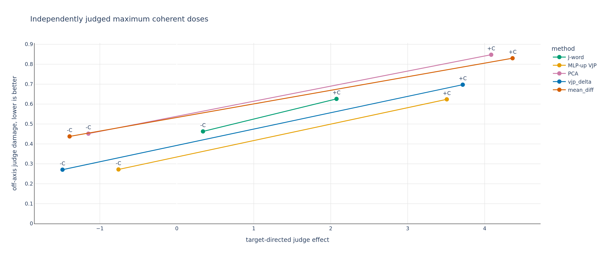

# Independently judged endpoint comparison

Each seed and sign uses its greatest tail coefficient that passed the health gate and had mean steered off-axis judge score at most 1.5. The table then averages those selected seed endpoints. It does not select the coefficient with the largest target effect.

| method | score | -C effect | -C damage | -C selected C | +C effect | +C damage | +C selected C | seeds |
| --- | --- | --- | --- | --- | --- | --- | --- | --- |
| J-word | -0.123 | 0.340 | 0.463 | 0.2806 | 2.075 | 0.626 | 0.3536 | 1 |
| MLP-up VJP | -1.030 | -0.758 | 0.272 | 8, 8, 8 | 3.508 | 0.624 | 25.4, 25.4, 25.4 | 3 |
| PCA | -1.600 | -1.149 | 0.452 | 0.7937, 0.7937, 0.7937 | 4.085 | 0.848 | 1, 1.122, 1.122 | 3 |
| vjp_delta | -1.756 | -1.485 | 0.271 | 0.2227, 0.1984, 0.1984 | 3.715 | 0.697 | 0.63, 0.63, 0.63 | 3 |
| mean_diff | -1.831 | -1.393 | 0.438 | 0.8909, 0.8909, 0.8909 | 4.363 | 0.830 | 1, 1, 1 | 3 |
