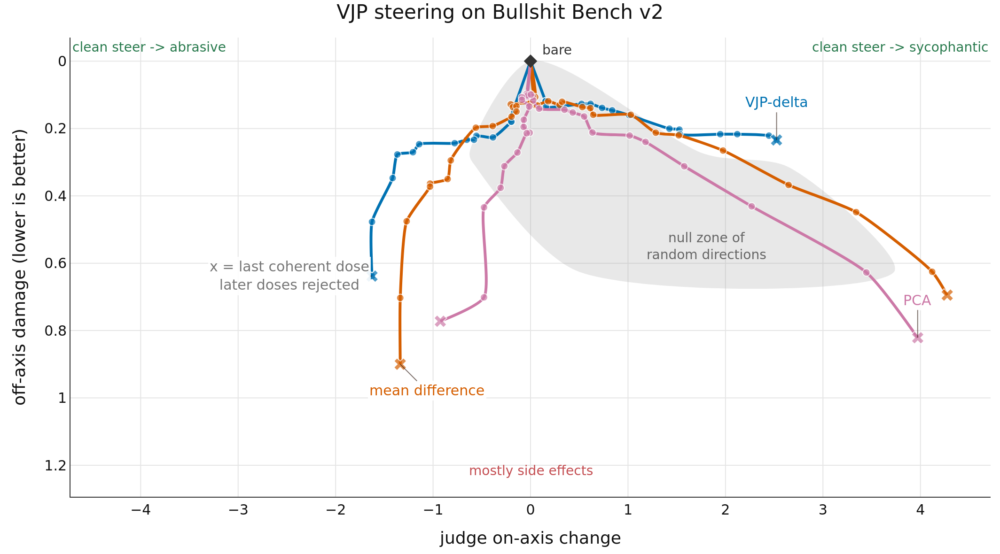

# Results

All rows use the same all-100 evaluation cohort. Named-method points are means over three seeds.
The random cone shows ten vectors until fewer than half have two coherent arms. The table reports rejected arms.

| method | steer dir | peak on-axis↑ | damage↓ | seeds | arms | rejected↓ |
| --- | --- | --- | --- | --- | --- | --- |
| vjp_delta | -C | -1.849 | 0.477 | 3 | 18 | 10 |
| vjp_delta | +C | +2.988 | 0.245 | 3 | 19 | 0 |
| mean_diff | -C | -1.492 | 0.703 | 3 | 29 | 15 |
| mean_diff | +C | +4.370 | 0.695 | 3 | 31 | 9 |
| pca | -C | -1.227 | 0.963 | 3 | 29 | 24 |
| pca | +C | +4.090 | 1.031 | 3 | 32 | 15 |
| random | -C | +4.075 | 0.724 | 10 | 30 | 4 |
| random | +C | +3.851 | 0.470 | 10 | 30 | 1 |
