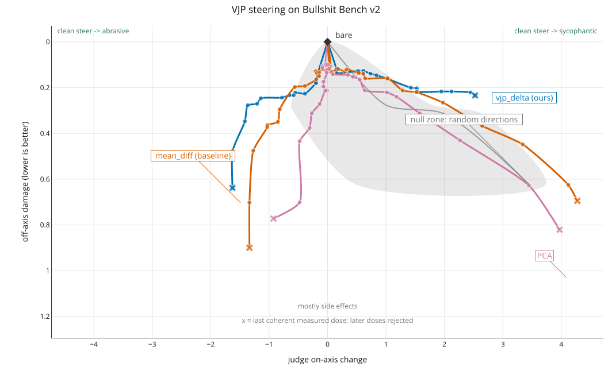

# Results

All rows use the same all-100 evaluation cohort. The figure shows both steering directions.
The random cone shows ten vectors until fewer than half have two coherent arms. The table reports rejected arms.

| method | steer dir | seeds | arms | rejected | peak on-axis | damage at peak |
| --- | --- | --- | --- | --- | --- | --- |
| vjp_delta | -C | 1 | 1 | 0 | -1.898 | 0.591 |
| vjp_delta | +C | 1 | 1 | 0 | +2.373 | 0.270 |
| mean_diff | -C | 1 | 3 | 0 | -1.077 | 0.465 |
| mean_diff | +C | 1 | 3 | 0 | +3.792 | 0.506 |
| pca | -C | 1 | 3 | 0 | -0.489 | 0.483 |
| pca | +C | 1 | 3 | 0 | +3.985 | 0.787 |
| random | -C | 10 | 24 | 4 | +4.075 | 0.723 |
| random | +C | 10 | 25 | 3 | +3.851 | 0.470 |
