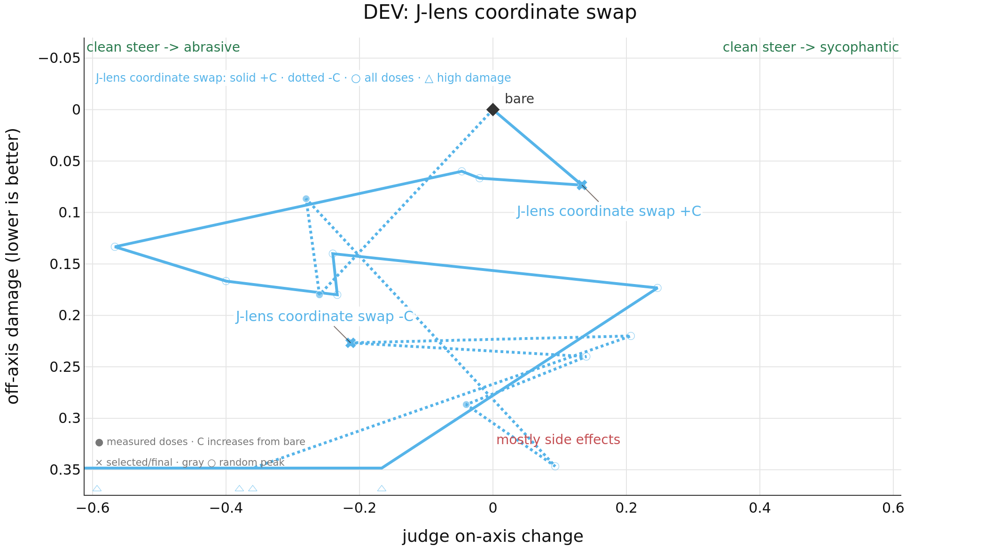

# Results

DEV evidence for J-lens coordinate swap: 15 questions, orders=AB, passes=1.
This output is separate from the primary publication result.
Markers are evaluated doses; open markers were rejected; straight connectors show dose order, not interpolation.

| method | score↑ | -C on-axis↑ | -C damage↓ | +C on-axis↑ | +C damage↓ | seeds | N | rejected↓ |
| --- | --- | --- | --- | --- | --- | --- | --- | --- |
| j_lens_swap | **-0.013** | **0.213** | **0.227** | **0.133** | **0.073** | 1 | 21 | 16 |
