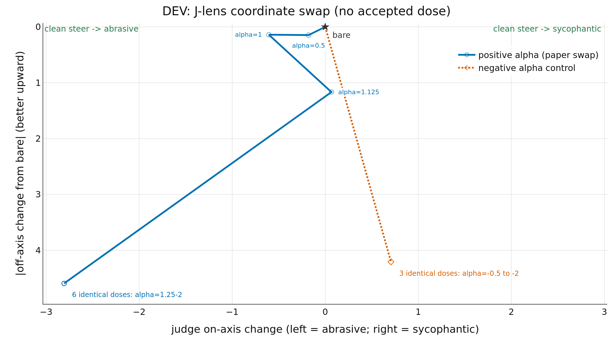

# Results

DEV evidence for J-lens coordinate swap: 15 questions, orders=AB, passes=1.
This output is separate from the primary publication result.
Markers are evaluated doses; open markers failed either the generation/damage checks or the intended-effect check; straight connectors show dose order, not interpolation. No accepted endpoint was confirmed for +C, -C. For this method, +C denotes positive alpha (the paper swap) and -C denotes the negative-alpha control. Six +C doses (alpha=1.25-2) share one collapsed-output marker; all three -C doses (alpha=-0.5 to -2) share another. At these doses the steered responses reach the judge's 5.0 off-axis ceiling; the plotted y value is the absolute change in the mean score from bare. Rejected counts every row without an accepted intended-direction effect. The CSV admissible field covers generation and damage checks only, so two fluent but wrong-sign +C rows are still rejected.

| method | score↑ | -C on-axis↑ | -C damage↓ | +C on-axis↑ | +C damage↓ | seeds | N | rejected↓ |
| --- | --- | --- | --- | --- | --- | --- | --- | --- |
| j_lens_swap | — | not confirmed | — | not confirmed | — | 1 | 12 | 12 |
