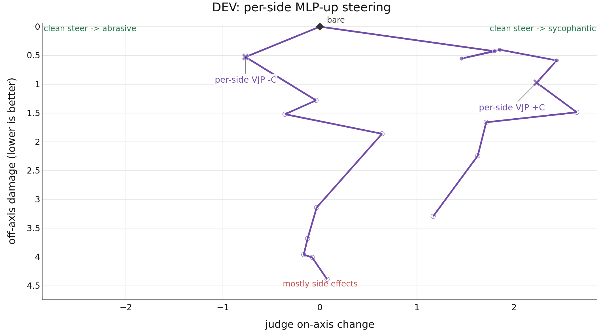

# Results

DEV evidence for vjp_mlp_up_left_right_shrink: 15 questions, orders=AB, passes=1.
This output is separate from the primary publication result.
Markers are evaluated doses; open markers were rejected; straight connectors show dose order, not interpolation.

| method | score↑ | -C on-axis↑ | -C damage↓ | +C on-axis↑ | +C damage↓ | seeds | N | rejected↓ |
| --- | --- | --- | --- | --- | --- | --- | --- | --- |
| vjp_mlp_up_left_right_shrink | **+0.240** | **0.767** | **0.527** | **2.233** | **0.973** | 1 | 18 | 12 |
