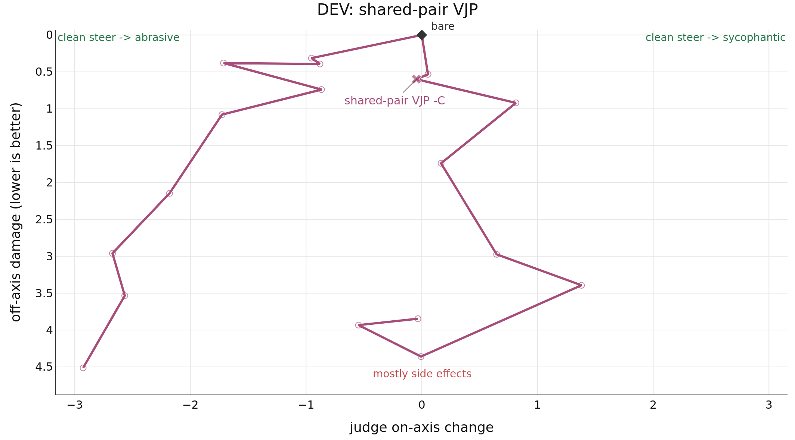

# Results

DEV evidence for shared-pair VJP: 15 questions, orders=AB, passes=1.
This output is separate from the primary publication result.
Markers are evaluated doses; open markers were rejected; straight connectors show dose order, not interpolation. No accepted endpoint was confirmed for +C.

| method | score↑ | -C on-axis↑ | -C damage↓ | +C on-axis↑ | +C damage↓ | seeds | N | rejected↓ |
| --- | --- | --- | --- | --- | --- | --- | --- | --- |
| vjp_mlp_up_shared_eb | — | **0.047** | **0.600** | not confirmed | — | 1 | 18 | 17 |
