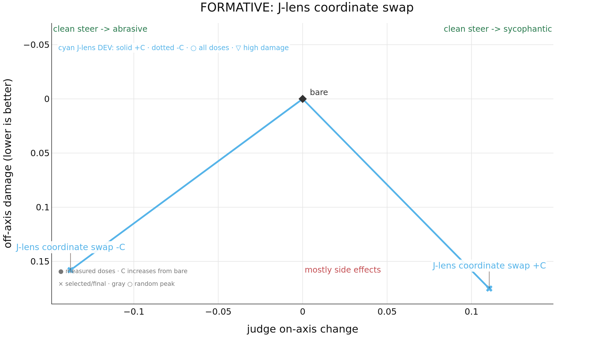

# Results

FORMATIVE evidence for J-lens coordinate swap: 100 questions, orders=AB,BA, passes=1.
This output is separate from the primary publication result.
Markers are evaluated doses; open markers were rejected; straight connectors show dose order, not interpolation.

| method | score↑ | -C on-axis↑ | -C damage↓ | +C on-axis↑ | +C damage↓ | seeds | N | rejected↓ |
| --- | --- | --- | --- | --- | --- | --- | --- | --- |
| j_lens_swap | **-0.065** | **0.138** | **0.158** | **0.110** | **0.175** | 1 | 2 | 0 |
