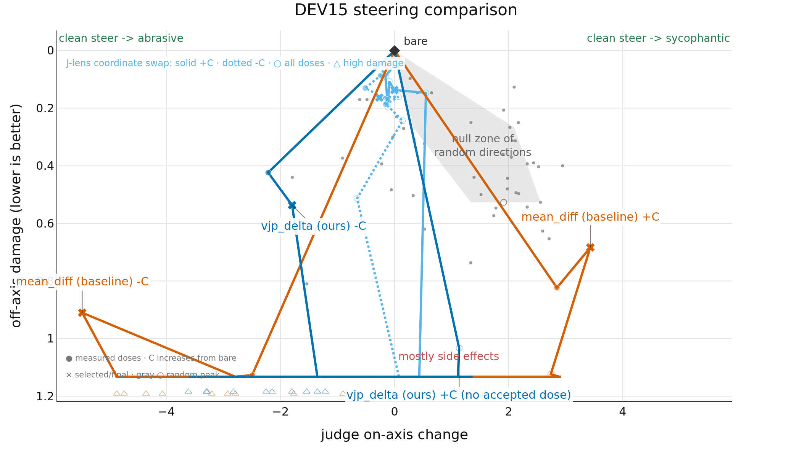
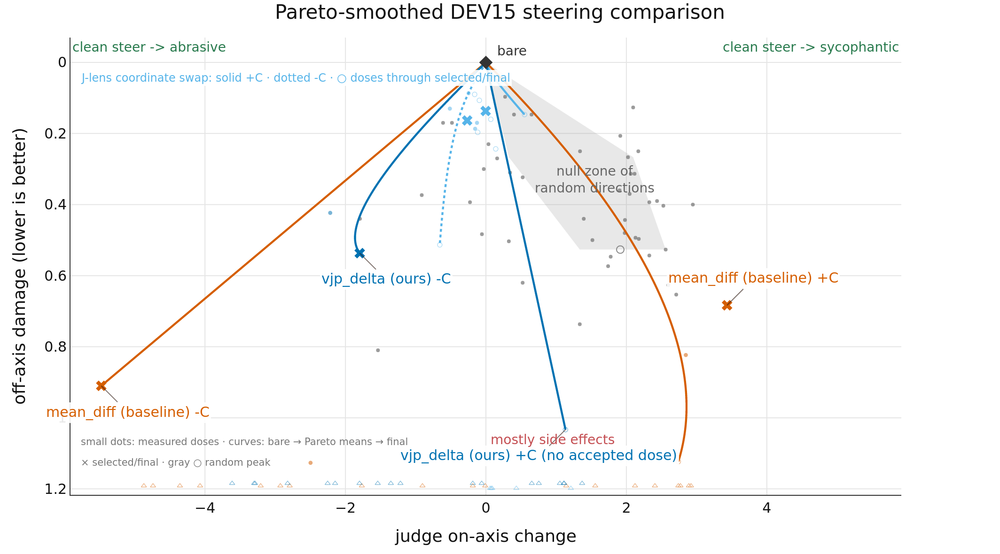

# Results

DEV15 comparison only. Every point passed exact scenario, shared-bare, generation-config, AB/BA judgment, and coherence provenance checks.
The gray region and measured gray dots are five random vectors. It is a descriptive reference, not a confidence interval. `not eligible` means an incoherent or wrong-direction measured point; raw rows are in `dev-comparison.csv`.

## Measured dose paths

## Pareto-smoothed paths

| method | score↑ | -C on-axis↑ | -C damage↓ | +C on-axis↑ | +C damage↓ | seeds | N | not eligible↓ |
| --- | --- | --- | --- | --- | --- | --- | --- | --- |
| mean_diff | **+2.750** | **5.477** | 0.910 | **3.433** | 0.683 | 1 | 24 | 20 |
| j_lens_swap | +0.040 | 0.513 | **0.130** | 0.080 | **0.040** | 1 | 21 | 13 |
| vjp_delta | — | 2.217 | 0.423 | not confirmed | — | 1 | 21 | 19 |
| *random* | — | not confirmed | — | 1.913 | 0.527 | 5 | 2 | 0 |
