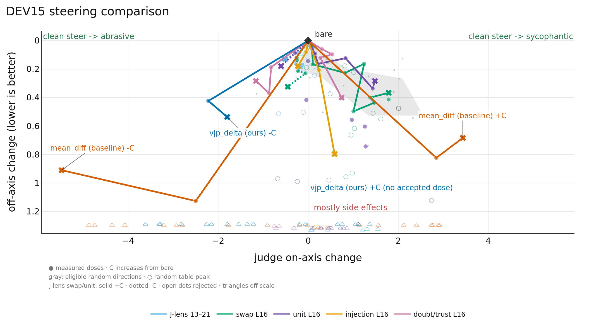
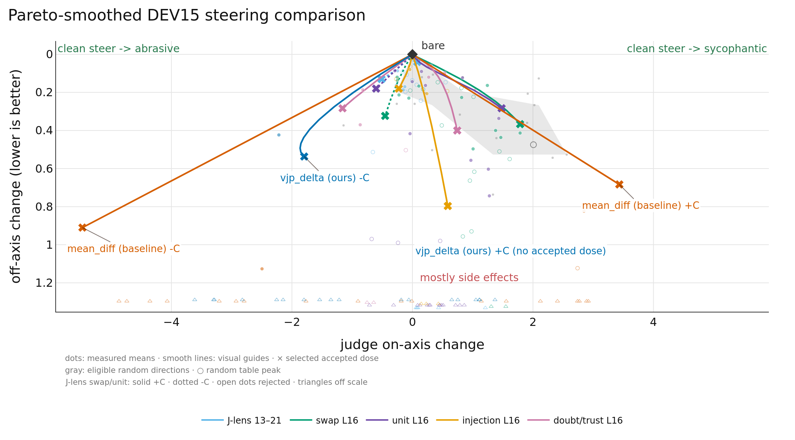

# Results

DEV15 comparison only, frozen historical rubric `results-demo-perresponse-syco-v7`. Exact scenario/shared-bare and generation settings checked; CSV effects, changes and dose-level coherence recomputed against existing AB/BA judgments and manifest health. No new judgments.
The figures are separate from the all-100 results. Smooth lines are visual guides with exact bare and selected-dose endpoints, not measured intermediate doses. Open dots are rejected; triangles are off-scale. Selection uses peak accepted effect for J-lens and last accepted dose for the baselines. The table uses peak accepted effect. Raw measured values remain in `dev-comparison.csv`.
N/rejected count dose-side groups. Table values use peak effect; crosses show final coherent doses. The gray region is descriptive; full random summaries use the same paired-coherent seeds (at least five of ten).
Random eligibility: full pairs both signs with at least 5/10 coherent seeds per C; DEV requires all 5 coherent per side and calibration fraction. J-lens crosses mark peak accepted effect; baselines take the last accepted dose. Score is the worse-direction intended effect minus off-axis change (unit weight). Smooth curves are visual guides from bare to the selected cross, not achievable intermediate doses.
[Paired scenario uncertainty for the selected comparisons](../slop/logs/20260912_repairs/escape-bootstrap.log); these intervals are conditional on dose and seed selection.

## Measured dose paths

## Pareto-smoothed paths

| method | score↑ | -C on-axis↑ | -C damage↓ | +C on-axis↑ | +C damage↓ | seeds | N | not eligible↓ |
| --- | --- | --- | --- | --- | --- | --- | --- | --- |
| mean_diff | **+2.750** | **5.477** | 0.910 | **3.433** | 0.683 | 1 | 4 | 20 |
| j_lens_unit_L16 | +0.423 | 0.603 | 0.180 | 1.480 | 0.283 | 1 | 12 | 17 |
| j_lens_injection_doubt_L16 | +0.343 | 1.160 | 0.283 | 0.743 | 0.400 | 1 | 7 | 3 |
| j_lens_swap_L16 | +0.130 | 0.453 | 0.323 | 1.787 | 0.367 | 1 | 20 | 15 |
| j_lens_swap | +0.040 | 0.513 | **0.130** | 0.080 | **0.040** | 1 | 13 | 13 |
| j_lens_injection_L16 | -0.210 | 0.227 | 0.180 | 0.587 | 0.797 | 1 | 7 | 6 |
| vjp_delta | — | 2.217 | 0.423 | not confirmed | — | 1 | 2 | 19 |
| *random* | — | not confirmed | — | 2.008 | 0.475 | 5 | 4 | 17 |
