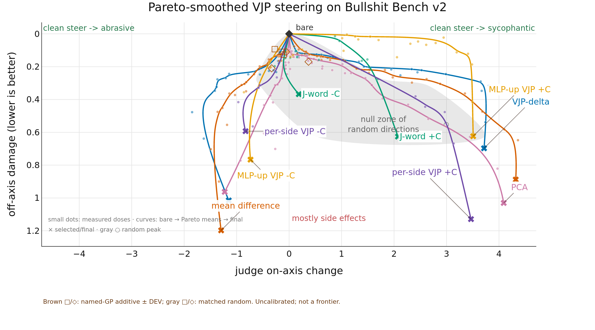

# Results

All table rows use the same all-100 evaluation cohort. The table reports each named method's seed count.
The random cone shows ten vectors until fewer than half have two coherent directions. The table reports rejected evaluations.
Both figures retain the all-100 baselines and prior methods. The first connects their displayed admissible dose means in dose order. The additional figure shows measured dose means as small dots and smoothly connects bare, the intended-side Pareto-efficient means, and each selected/final endpoint.

## Measured dose paths

## Pareto-smoothed paths

| method | score↑ | -C on-axis↑ | -C damage↓ | +C on-axis↑ | +C damage↓ | seeds | N | rejected↓ |
| --- | --- | --- | --- | --- | --- | --- | --- | --- |
| vjp_delta | **+1.371** | **1.849** | 0.477 | 3.806 | **0.314** | 3 | 42 | 28 |
| mean_diff | +0.789 | 1.492 | 0.703 | **4.362** | 0.648 | 3 | 60 | 36 |
| vjp_mlp_up_left_right_shrink | +0.552 | 0.968 | 0.416 | 3.466 | 1.129 | 1 | 11 | 1 |
| vjp_mlp_up_shrink | +0.505 | 0.861 | 0.356 | 3.508 | 0.624 | 3 | 26 | 7 |
| pca | +0.265 | 1.227 | 0.963 | 4.090 | 1.031 | 3 | 61 | 39 |
| J_word | +0.078 | 0.275 | **0.197** | 2.075 | 0.626 | 1 | 13 | 3 |
| *random* | -0.782 | -0.425 | 0.357 | 2.995 | 0.553 | 10 | 6 | 5 |

## Named-GP additive DEV — incomplete

Incomplete, uncalibrated DEV15; all measured alpha=1,2,4 doses retained. Matched random seeds judged: 0/10 ([]). Coherence eligibility unknown; no accepted frontier. New layer17/current-position controls are not the historical random cone. Alpha1 minus DNL had identical baseline/steered text and token IDs, but AB invented a quote and scored +1.6; BA scored 0. Raw scores are retained. AB/BA disagreements are shown, not resolved by selecting an order. This reused DEV cohort is not directly comparable to the all-100 table above; both project goals remain open.

| Evidence   | Method            | Seed   | Alpha   | Side   | Effect →±   | AB →±   | BA →±   | Damage ↓   |
|------------|-------------------|--------|---------|--------|-------------|---------|---------|------------|
| 1          | named-GP additive | —      | 1       | +C     | -0.107      | -0.013  | -0.200  | 0.127      |
| 2          | named-GP additive | —      | 1       | -C     | -0.333      | -0.173  | -0.493  | 0.210      |
| 3          | named-GP additive | —      | 2       | +C     | -0.140      | +0.047  | -0.327  | 0.110      |
| 4          | named-GP additive | —      | 2       | -C     | -0.057      | +0.100  | -0.213  | 0.110      |
| 5          | named-GP additive | —      | 4       | +C     | -0.273      | -0.493  | -0.053  | 0.093      |
| 6          | named-GP additive | —      | 4       | -C     | +0.370      | +0.453  | +0.287  | 0.170      |

1. [Raw judgments](../slop/logs/20260907_j_lens_additive_concepts/judgments.jsonl) · [Responses and delivery](../slop/logs/20260907_j_lens_additive_concepts/generation.json)
2. [Raw judgments](../slop/logs/20260907_j_lens_additive_concepts/judgments.jsonl) · [Responses and delivery](../slop/logs/20260907_j_lens_additive_concepts/generation.json)
3. [Raw judgments](../slop/logs/20260907_j_lens_additive_concepts_alpha2/judgments.jsonl) · [Responses and delivery](../slop/logs/20260907_j_lens_additive_concepts_alpha2/generation.json)
4. [Raw judgments](../slop/logs/20260907_j_lens_additive_concepts_alpha2/judgments.jsonl) · [Responses and delivery](../slop/logs/20260907_j_lens_additive_concepts_alpha2/generation.json)
5. [Raw judgments](../slop/logs/20260907_j_lens_additive_concepts_alpha4/judgments.jsonl) · [Responses and delivery](../slop/logs/20260907_j_lens_additive_concepts_alpha4/generation.json)
6. [Raw judgments](../slop/logs/20260907_j_lens_additive_concepts_alpha4/judgments.jsonl) · [Responses and delivery](../slop/logs/20260907_j_lens_additive_concepts_alpha4/generation.json)
