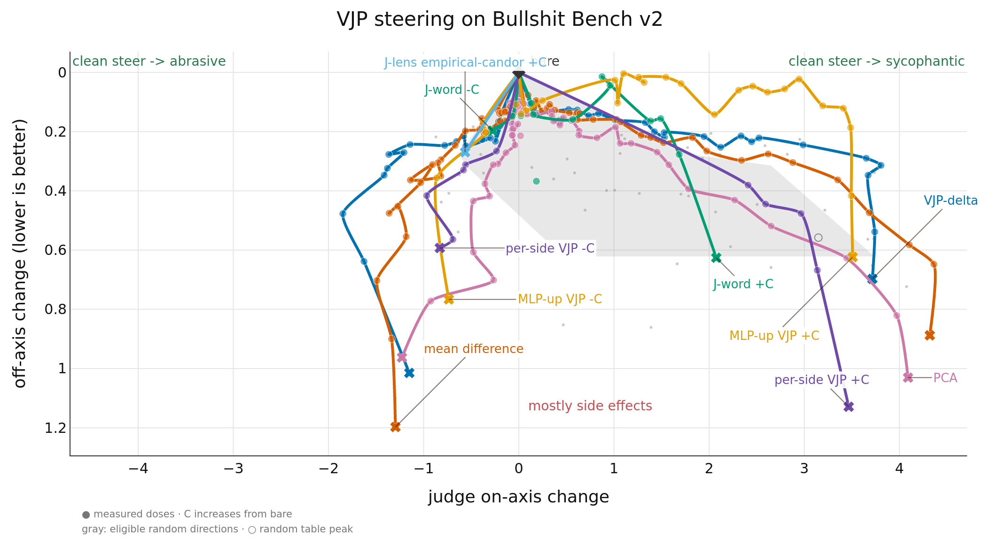
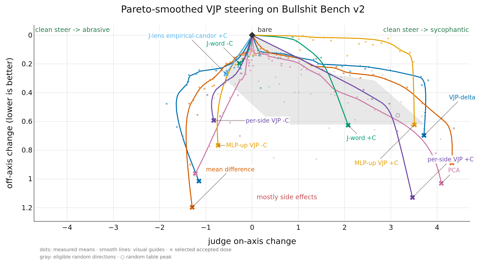

# Results

The primary table uses the all-100 evaluation cohort and reports each named method's seed count.
N/rejected count dose-side groups. Table values use peak effect; crosses show final coherent doses. The gray region is descriptive; full random summaries use the same paired-coherent seeds (at least five of ten).
Random eligibility: full pairs both signs with at least 5/10 coherent seeds per C; DEV requires all 5 coherent per side and calibration fraction. J-lens crosses mark peak accepted effect; baselines take the last accepted dose. Score is the worse-direction intended effect minus off-axis change (unit weight). Smooth curves are visual guides from bare to the selected cross, not achievable intermediate doses.
J-lens empirical-candor is one selected all-100 run: its source +C is mapped to the candidness target, so its negative +C common-axis value is the intended direction. Fifteen rows were selection-exposed; the non-DEV85 result is descriptive. AB/BA signs reverse in 34/100 pairs, and the DEV random control was not matched in realized perturbation strength.
Both figures retain the all-100 baselines and prior methods. The first connects their displayed admissible dose means in dose order. Smooth curves are visual guides from bare through accepted Pareto control points to the selected crosses, not measured or achievable intermediate doses. Crosses mark the last accepted dose (J-lens: peak intended effect); the table selects peak intended effect, which can be a different dose.

## Measured dose paths

## Pareto-smoothed paths

| method | score↑ | -C on-axis↑ | -C damage↓ | +C on-axis↑ | +C damage↓ | seeds | N | rejected↓ |
| --- | --- | --- | --- | --- | --- | --- | --- | --- |
| vjp_delta | **+1.371** | **1.849** | 0.477 | 3.806 | 0.314 | 3 | 42 | 19 |
| mean_diff | +0.789 | 1.492 | 0.703 | **4.362** | 0.648 | 3 | 60 | 15 |
| vjp_mlp_up_left_right_shrink | +0.552 | 0.968 | 0.416 | 3.466 | 1.129 | 1 | 11 | 1 |
| vjp_mlp_up_shrink | +0.505 | 0.861 | 0.356 | 3.508 | 0.624 | 3 | 26 | 6 |
| pca | +0.265 | 1.227 | 0.963 | 4.090 | 1.031 | 3 | 61 | 25 |
| J_word | +0.078 | 0.275 | **0.197** | 2.075 | 0.626 | 1 | 13 | 5 |
| *random* | — | not confirmed | — | 3.148 | 0.558 | 10 | 6 | 3 |
| J-lens empirical-candor (+C source) | — | not confirmed | — | -0.565 | **0.270** | 1 | 1 | 0 |
